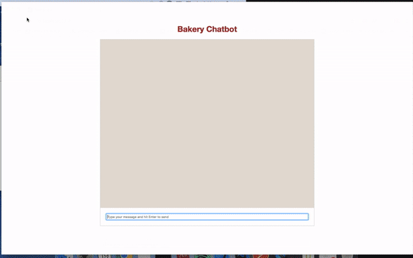

## Demo

  

## Stack
Front: React.js Back: Node.js + Dialogflow
1. Clone this repository and `cd` into it.
2. Execute `npm install`
3. Run `node server.js`
4. `cd` into the `react-bot` folder, run `npm install` followed by `yarn start`

